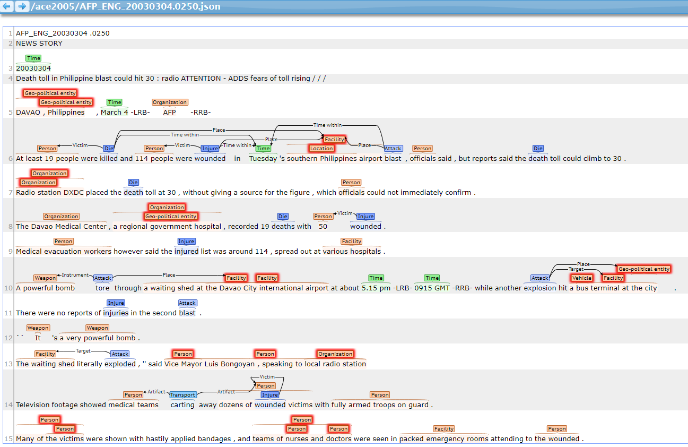

# ACE 2005 Event Extraction Data Preprocess

## Description
This project ties together numerous tools. It converts from the [ACE2005 file format](https://catalog.ldc.upenn.edu/LDC2006T06) (.sgm and .apf.xml files) to Concrete.
It also annotates the ACE 2005 data using Stanford CoreNLP and the chunklink.pl script from CoNLL-2000.
By the way, the data is converted to json and [brat](http://brat.nlplab.org/) annotations.
See below for possible appropriate citations. (Later)
This project is modified from [this repo](https://github.com/mgormley/ace-data-prep).

The output of the pipeline is available in three formats: Concrete, JSON, and Brat Annotation.
Concrete is a data serialization format for NLP. See the [primer on Concrete](http://hltcoe.github.io/) for additional details.
As a convenience, the output is also converted to an easy-to-parse [Concatenated JSON format](https://en.wikipedia.org/wiki/JSON_Streaming#Concatenated_JSON).

A document will be splited into sentences by Stanford CoreNLP and each document will be trnasfered into a new file with the same name prefix.
Here is a JSON example of a sentence.
```json
[
    {
        "penn-treebank":"(ROOT (S (S (NP (NP (DT The) (NN skeleton)) (PP (IN of) (NP (DT a) (JJ second) (NN baby)))) (VP (VBZ has) (VP (VBN been) (VP (VBN found) (PP (IN at) (NP (NP (DT a) (JJ rural) (NNP Wisconsin) (NN home)) (SBAR (WHADVP (WRB where)) (S (NP (NP (DT a) (JJ 22-year-old) (NN woman) (POS 's)) (JJ dead) (NN infant)) (VP (VBD was) (VP (VBN discovered) (PP (IN in) (NP (DT a) (JJ blue) (NN plastic) (NN container))) (NP-TMP (NNP June) (CD 8)))))))))))) (, ,) (NP (NNS officials)) (VP (VBD said) (NP-TMP (NNP Monday))) (. .)))",
        "stanford-colcc":[
            "root/dep=32/gov=-1",
            "det/dep=0/gov=1",
            "nsubjpass/dep=1/gov=8",
            "det/dep=3/gov=5",
            "amod/dep=4/gov=5",
            "prep_of/dep=5/gov=1",
            "aux/dep=6/gov=8",
            "auxpass/dep=7/gov=8",
            "ccomp/dep=8/gov=32",
            "det/dep=10/gov=13",
            "amod/dep=11/gov=13",
            "nn/dep=12/gov=13",
            "prep_at/dep=13/gov=8",
            "advmod/dep=14/gov=22",
            "det/dep=15/gov=17",
            "amod/dep=16/gov=17",
            "poss/dep=17/gov=20",
            "amod/dep=19/gov=20",
            "nsubjpass/dep=20/gov=22",
            "auxpass/dep=21/gov=22",
            "rcmod/dep=22/gov=13",
            "det/dep=24/gov=27",
            "amod/dep=25/gov=27",
            "nn/dep=26/gov=27",
            "prep_in/dep=27/gov=22",
            "tmod/dep=28/gov=22",
            "num/dep=29/gov=28",
            "nsubj/dep=31/gov=32",
            "tmod/dep=33/gov=32"
        ],
        "golden-entity-mentions":[
            {
                "phrase-type":"NOM",
                "end":18,
                "text":"a 22-year-old woman",
                "entity-type":"PER:Individual",
                "start":15,
                "id":"EM 0-2-14"
            },
            {
                "phrase-type":"NAM",
                "end":13,
                "text":"Wisconsin",
                "entity-type":"GPE:State-or-Province",
                "start":12,
                "id":"EM 0-6-0"
            },
            {
                "phrase-type":"NOM",
                "end":30,
                "text":"a rural Wisconsin home where a 22-year-old woman 's dead infant was discovered in a blue plastic container June 8",
                "entity-type":"FAC:Building-Grounds",
                "start":10,
                "id":"EM 0-7-3"
            },
            {
                "phrase-type":"PRO",
                "end":15,
                "text":"where",
                "entity-type":"FAC:Building-Grounds",
                "start":14,
                "id":"EM 0-7-4"
            },
            {
                "phrase-type":"NOM",
                "end":6,
                "text":"The skeleton of a second baby",
                "entity-type":"PER:Individual",
                "start":0,
                "id":"EM 0-8-0"
            },
            {
                "phrase-type":"NOM",
                "end":6,
                "text":"a second baby",
                "entity-type":"PER:Individual",
                "start":3,
                "id":"EM 0-8-3"
            },
            {
                "phrase-type":"NOM",
                "end":21,
                "text":"a 22-year-old woman 's dead infant",
                "entity-type":"PER:Individual",
                "start":15,
                "id":"EM 0-24-3"
            },
            {
                "phrase-type":"NOM",
                "end":32,
                "text":"officials",
                "entity-type":"PER:Group",
                "start":31,
                "id":"EM 0-45-0"
            },
            {
                "phrase-type":"TIM",
                "end":30,
                "text":"June 8",
                "entity-type":"TIM:time",
                "start":28,
                "id":"EM 0-49-0"
            },
            {
                "phrase-type":"TIM",
                "end":17,
                "text":"22-year-old",
                "entity-type":"TIM:time",
                "start":16,
                "id":"EM 0-50-0"
            },
            {
                "phrase-type":"TIM",
                "end":34,
                "text":"Monday",
                "entity-type":"TIM:time",
                "start":33,
                "id":"EM 0-52-0"
            }
        ],
        "conll-head":[
            2,
            9,
            2,
            6,
            6,
            3,
            9,
            9,
            33,
            9,
            14,
            14,
            14,
            10,
            23,
            18,
            18,
            21,
            18,
            21,
            23,
            23,
            14,
            23,
            28,
            28,
            28,
            24,
            23,
            29,
            "",
            33,
            0,
            33,
            ""
        ],
        "chunk":[
            "B-NP",
            "I-NP",
            "B-PP",
            "B-NP",
            "I-NP",
            "I-NP",
            "B-VP",
            "I-VP",
            "I-VP",
            "B-PP",
            "B-NP",
            "I-NP",
            "I-NP",
            "I-NP",
            "B-ADVP",
            "B-NP",
            "I-NP",
            "I-NP",
            "B-NP",
            "I-NP",
            "I-NP",
            "B-VP",
            "I-VP",
            "B-PP",
            "B-NP",
            "I-NP",
            "I-NP",
            "I-NP",
            "B-NP",
            "I-NP",
            "O",
            "B-NP",
            "B-VP",
            "B-NP",
            "O"
        ],
        "lemma":[
            "the",
            "skeleton",
            "of",
            "a",
            "second",
            "baby",
            "have",
            "be",
            "find",
            "at",
            "a",
            "rural",
            "Wisconsin",
            "home",
            "where",
            "a",
            "22-year-old",
            "woman",
            "'s",
            "dead",
            "infant",
            "be",
            "discover",
            "in",
            "a",
            "blue",
            "plastic",
            "container",
            "June",
            "8",
            ",",
            "official",
            "say",
            "Monday",
            "."
        ],
        "words":[
            "The",
            "skeleton",
            "of",
            "a",
            "second",
            "baby",
            "has",
            "been",
            "found",
            "at",
            "a",
            "rural",
            "Wisconsin",
            "home",
            "where",
            "a",
            "22-year-old",
            "woman",
            "'s",
            "dead",
            "infant",
            "was",
            "discovered",
            "in",
            "a",
            "blue",
            "plastic",
            "container",
            "June",
            "8",
            ",",
            "officials",
            "said",
            "Monday",
            "."
        ],
        "pos-tags":[
            "DT",
            "NN",
            "IN",
            "DT",
            "JJ",
            "NN",
            "VBZ",
            "VBN",
            "VBN",
            "IN",
            "DT",
            "JJ",
            "NNP",
            "NN",
            "WRB",
            "DT",
            "JJ",
            "NN",
            "POS",
            "JJ",
            "NN",
            "VBD",
            "VBN",
            "IN",
            "DT",
            "JJ",
            "NN",
            "NN",
            "NNP",
            "CD",
            ",",
            "NNS",
            "VBD",
            "NNP",
            "."
        ],
        "golden-event-mentions":[
            {
                "arguments":[
                    {
                        "start":14,
                        "role":"Place",
                        "end":15,
                        "entity-type":"FAC:Building-Grounds",
                        "text":"where"
                    },
                    {
                        "start":28,
                        "role":"Time-Before",
                        "end":30,
                        "entity-type":"TIM:time",
                        "text":"June 8"
                    },
                    {
                        "start":15,
                        "role":"Victim",
                        "end":21,
                        "entity-type":"PER:Individual",
                        "text":"a 22-year-old woman 's dead infant"
                    }
                ],
                "trigger":{
                    "start":19,
                    "end":20,
                    "text":"dead"
                },
                "id":"SM 0-8-0",
                "event_type":"Life:Die"
            }
        ]
    }
]
```

The words, entities, and events are given by the original ACE 2005 data.
The lemmas, part-of-speech tags, labeled syntactic dependency parses, and constituency parses are automatically annotated by [Stanford CoreNLP](https://github.com/stanfordnlp/CoreNLP).
The chunks are derived from the constituency parse using a [python wrapper](https://github.com/mgormley/concrete-chunklink) of the chunklink.pl script from CoNLL-2000.

After executing ```make LDC_DIR=./LDC OUT_DIR=./output ace05splits``` (see details below), the output will consist of the following directories:

* `LDC2006T06_temp_copy/`: A copy of the LDC input directory with DTD files placed appropriately.
* `ace-05-comms/`: The ACE 2005 data converted to Concrete.
* `ace-05-comms-ptb-anno/`: The ACE 2005 data converted to Concrete and annotated with Stanford CoreNLP.
* `ace-05-comms-ptb-anno-chunks/`: The ACE 2005 data converted to Concrete and annotated with Stanford CoreNLP and chunklink.pl.
* `ace-05-json/`: The fully annotated data converted to Concatenated JSON.
* `ace-05-brat/`: The fully annotated data converted to Brat Annotation.

We recommend all users of this pipeline use the files in `ace-05-splits` for good.

## Requirements

- Java 1.8+
- Maven 3.4+
- Python 2.7.x
- GNU Make

## Convert and Annotate Full Dataset

A Makefile is included to  to convert the full ACE 2005 dataset to Concrete.
The same Makefile will also add Stanford CoreNLP annotations and convert the constituency trees to chunks with chunklink.pl. 
It will also require install the latest version of concrete-python and clone the concrete-chunklink repository. 

The command below will convert the data to Concrete (with AceApf2Concrete), annotate (with Stanford and chunklink.pl), and transform the data into JSON and Brat Annotation (with concrete2json.py and json2brat.py).

    make LDC_DIR=<path to LDC dir> \
         OUT_DIR=<path for output dir> \
         ace05splits

## One More Step to Vistualize ACE2005 in Brat
1. Copy the `ace-05-brat/` to a place under `$BRAT_ROOT$/data/`
2. Copy the `brat-dataconverter/visual.conf` to `$BRAT_ROOT$`, and of course plesse backup the old one. 

Finally, you can get this view.


## Train/Test/Dev Split
The files used in train/test/development set is in the folder `qi_filelist` which is the same in (Ji et al., 2008; Li et al., 2013;  Feng et al., 2016).
```bibtex
@inproceedings{DBLP:conf/acl/JiG08,
  author    = {Heng Ji and
               Ralph Grishman},
  title     = {Refining Event Extraction through Cross-Document Inference},
  booktitle = {{ACL} 2008, Proceedings of the 46th Annual Meeting of the Association
               for Computational Linguistics, June 15-20, 2008, Columbus, Ohio, {USA}},
  pages     = {254--262},
  year      = {2008},
  crossref  = {DBLP:conf/acl/2008},
  url       = {http://www.aclweb.org/anthology/P08-1030},
  timestamp = {Mon, 04 Mar 2013 20:57:25 +0100},
  biburl    = {https://dblp.org/rec/bib/conf/acl/JiG08},
  bibsource = {dblp computer science bibliography, https://dblp.org}
}

@inproceedings{DBLP:conf/acl/LiJH13,
  author    = {Qi Li and
               Heng Ji and
               Liang Huang},
  title     = {Joint Event Extraction via Structured Prediction with Global Features},
  booktitle = {Proceedings of the 51st Annual Meeting of the Association for Computational
               Linguistics, {ACL} 2013, 4-9 August 2013, Sofia, Bulgaria, Volume
               1: Long Papers},
  pages     = {73--82},
  year      = {2013},
  crossref  = {DBLP:conf/acl/2013-1},
  url       = {http://aclweb.org/anthology/P/P13/P13-1008.pdf},
  timestamp = {Tue, 30 Jan 2018 09:13:52 +0100},
  biburl    = {https://dblp.org/rec/bib/conf/acl/LiJH13},
  bibsource = {dblp computer science bibliography, https://dblp.org}
}

@inproceedings{DBLP:conf/acl/FengHTJQL16,
  author    = {Xiaocheng Feng and
               Lifu Huang and
               Duyu Tang and
               Heng Ji and
               Bing Qin and
               Ting Liu},
  title     = {A Language-Independent Neural Network for Event Detection},
  booktitle = {Proceedings of the 54th Annual Meeting of the Association for Computational
               Linguistics, {ACL} 2016, August 7-12, 2016, Berlin, Germany, Volume
               2: Short Papers},
  year      = {2016},
  crossref  = {DBLP:conf/acl/2016-2},
  url       = {http://aclweb.org/anthology/P/P16/P16-2011.pdf},
  timestamp = {Tue, 16 Aug 2016 10:16:33 +0200},
  biburl    = {https://dblp.org/rec/bib/conf/acl/FengHTJQL16},
  bibsource = {dblp computer science bibliography, https://dblp.org}
}
```

## Citations
Later